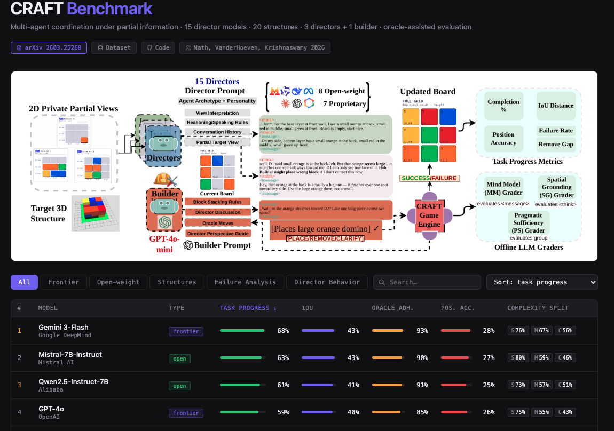
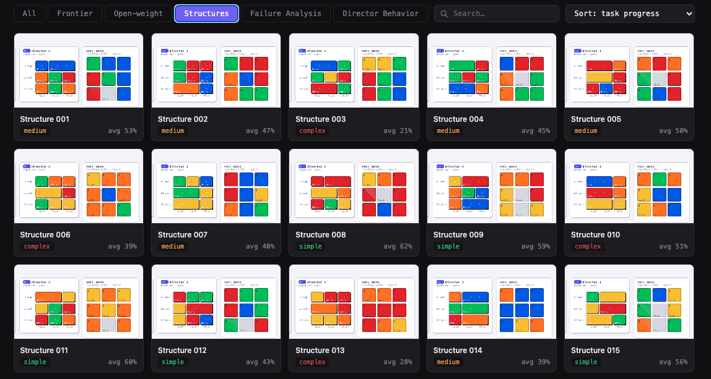
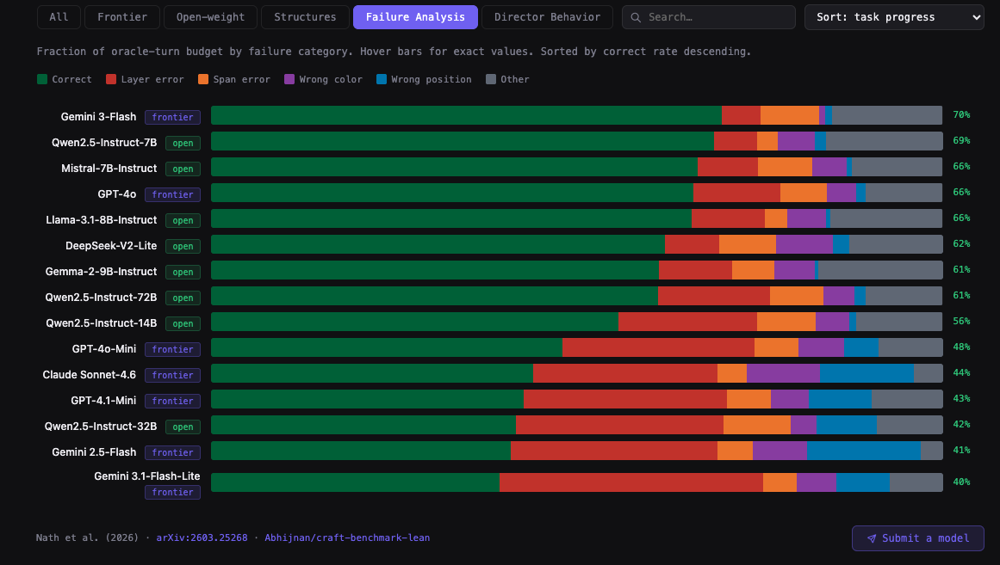
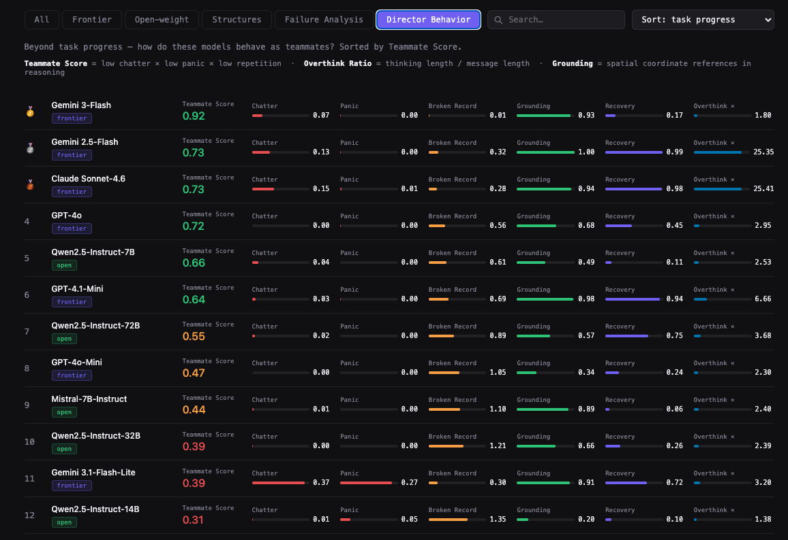
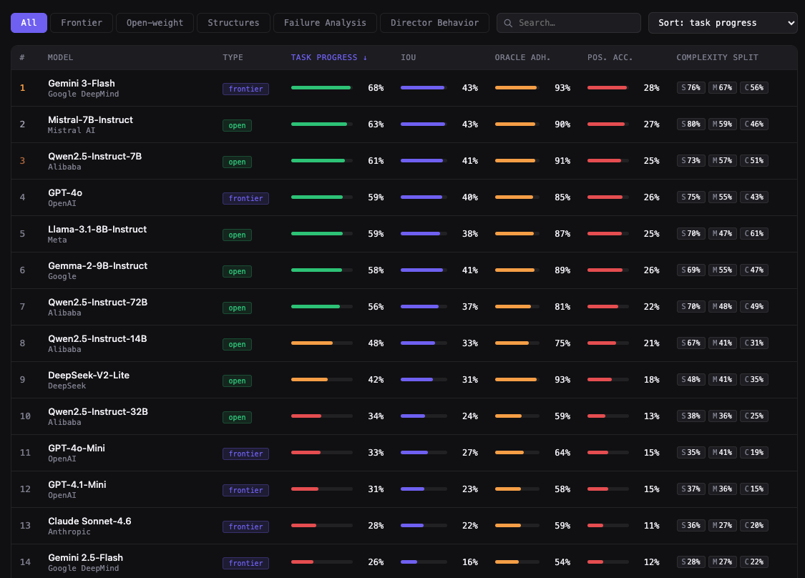

# CRAFT: Collaborative Reasoning Agents For Construction Tasks

<div align="center">

### 🏆 Leaderboard is live! Bring Your Own Director and Build!

**[→ huggingface.co/spaces/Abhijnan/craft-leaderboard](https://huggingface.co/spaces/Abhijnan/craft-leaderboard)**

[](https://huggingface.co/spaces/Abhijnan/craft-leaderboard)
[](https://arxiv.org/abs/2603.25268)
[](https://huggingface.co/datasets/Abhijnan/craft-benchmark-lean)



<table width="90%">
<tr>
<td width="50%"></td>
<td width="50%"></td>
</tr>
<tr>
<td width="50%"></td>
<td width="50%"></td>
</tr>
</table>

</div>

---

> **Official repository** for the paper [CRAFT: Grounded Multi-Agent Coordination Under Partial Information](https://arxiv.org/pdf/2603.25268) (2026).
 
 
[]()

> **CRAFT** is a multi-agent benchmark for evaluating pragmatic communication 
> in large language models under strict partial information. Three director 
> agents with complementary but incomplete views of a 3D target structure must 
> coordinate through natural language to guide a builder agent toward the correct 
> configuration — a task no single agent can solve alone.

## Supported Models

**Frontier (API):** GPT-4o, GPT-4o-Mini, GPT-4.1-Mini, Claude-Sonnet-4.6, 
Gemini-2.5-Flash, Gemini-3-Flash, Gemini-3.1-Flash-Lite

**Open-weight (local):** Qwen-2.5 7B/14B/32B/72B, Llama-3-8B, Mistral-7B, 
Gemma-2-9B, DeepSeek-V2-Lite


## Overview

CRAFT evaluates a fundamental question: does stronger individual reasoning 
translate to better multi-agent coordination? Across 8 open-weight and 7 
frontier models, we find the answer is often **no** — smaller open-weight 
models frequently match or outperform frontier systems, and higher individual 
communication quality does not guarantee better collaboration.

The benchmark provides:
- A procedurally generated 3D block construction task with physics-constrained validation
- An oracle-assisted builder interface that isolates director communication as the performance bottleneck
- A suite of LLM judges that decompose failures into spatial grounding, mind modeling, and pragmatic sufficiency

## Repository Structure
```
CRAFT/
├── run_craft.py                      # Main experiment runner (API + local models, CLI)
├── agents/
│   ├── director_agent.py             # DirectorAgent — prompt generation, API/local inference
│   ├── builder_agent.py              # BuilderAgent — move generation, tool use, simulation
│   ├── environment.py                # EnhancedGameState — physics engine, move execution
│   ├── oracle.py                     # Oracle move enumeration and validation
│   ├── builder_tools.py              # simulate_move — dry-run move validation
│   └── common_ground_agent.py        # Optional common ground tracking agent
├── structure_generator_v2.py         # Procedural 3D structure generation
├── task_progress_tracker.py          # Per-turn progress metrics
├── local_model_utils.py              # HuggingFace model loading utilities
├── judge_pragmatics.py               # PS-Judge implementation
├── sg_mm_judge_calls.py              # SG-Judge and MM-Judge implementation
├── plot_failure_taxonomy.py          # Failure mode analysis and plotting
├── train_sft.py                      # SFT training for director models (TRL + LoRA) (optional, not used in paper)
├── train_dpo.py                      # DPO training for director models (TRL + LoRA) (optional, not used in paper)
├── test_game_state_tracking.py       # Unit tests — physics engine correctness
├── test_oracle.py                    # Oracle validation suite — move stats and coverage
├── run_sample.sh                     # Sample experiment script (see Quick Start)
├── data/
│   └── structures_dataset_20.json    # 20 evaluation structures (7 simple,
│                                     # 8 medium, 5 complex; 21-25 blocks)
└── plotting_scripts/                 # Analysis and visualization scripts
```
## Installation
```bash
git clone https://github.com/csu-signal/CRAFT
cd CRAFT
pip install -r requirements.txt
```

Set API keys:
```bash
export OPENAI_API_KEY=...
export CLAUDE_API_KEY=...
export GEMINI_API_KEY=...
```

## Running Experiments

CRAFT uses a single CLI entry point for both API and local models. Full experimental dialog logs (CoT and public messages) and progress metrics from paper's experiments are provided in this [CRAFT Huggingface Dataset](https://huggingface.co/datasets/Abhijnan/craft-benchmark-lean)

**Paper experiments** (oracle, no tools, 20 turns, all 20 structures, empty start):
```bash
# API models
python run_craft.py --mode api --oracle --oracle_n 5 --no_tools --turns 20

# Specific frontier model
python run_craft.py --mode api --director gpt-4o-mini --oracle --oracle_n 5 --no_tools --turns 20

# Open-weight models
python run_craft.py --mode local --director qwen-7b --oracle --oracle_n 5 --no_tools --turns 20
```

**All CLI options:**
```
--mode        api | local               Director mode (default: api)
--director    model name or key         Single model to run (default: all)
--builder     model name                Builder model (default: gpt-4o-mini)
--dataset     path                      Structure dataset (default: data/structures_dataset_20.json)
--turns       int                       Max turns per game (default: 20)
--run         int                       Run index for seeding (default: 3)
--oracle                                Enable oracle candidate moves
--oracle_n    int                       Oracle moves per turn (default: 5)
--no_tools                              Disable builder simulate_move tool
--structures  e.g. 0,1,5               Subset of structures to run (default: all 20)
--quantize    4bit | 8bit               Quantization for large local models
--output      path                      Custom output directory
```
## Quick Start

Run the sample experiment script to verify your setup across all key conditions:
```bash
./run_sample.sh
```

This runs the following test cases on structure 0 with 5 turns each:
```bash
# API — oracle + no tools (builder selects from verified candidates)
python run_craft.py --mode api --director gpt-4o-mini --oracle --oracle_n 5 --no_tools --structures 0 --turns 5

# API — no oracle, no tools (free-form builder)
python run_craft.py --mode api --director gpt-4o-mini --no_tools --structures 0 --turns 5

# API — no oracle, with tools (builder uses simulate_move)
python run_craft.py --mode api --director gpt-4o-mini --structures 0 --turns 5

# Local — oracle + no tools (open-weight director)
python run_craft.py --mode local --director qwen-7b --oracle --oracle_n 5 --no_tools --structures 0 --turns 5

# Local — no oracle, no tools
python run_craft.py --mode local --director qwen-7b --no_tools --structures 0 --turns 5
```


## Output  is written to:
```
craft_results/{api|local}/{oracle5_no_tools_run3}/{director_model}_{builder_model}/
craft_structure_001_3.json
craft_structure_001_3.csv
```

## Output Format

Each game log contains full trajectory data per turn:
```json
{
  "experiment_info": {
    "timestamp": "...",
    "max_turns": 20,
    "use_oracle": true,
    "oracle_n": 5,
    "builder_tool_use": false,
    "run": 3,
    "models": {"director": "gpt-4o-mini", "builder": "gpt-4o-mini"}
  },
  "games": [{
    "structure_id": "structure_017",
    "complexity": "complex",
    "target_structure": {...},
    "target_spans": {...},
    "D1 Archetype": "cautious",
    "D2 Archetype": "synthesizer",
    "D3 Archetype": "skeptical",
    "turns": [{
      "turn_number": 1,
      "structure_before": {...},
      "spans_before": {...},
      "director_responses": {
        "D1": {"internal_thinking": "...", "public_message": "..."},
        "D2": {"internal_thinking": "...", "public_message": "..."},
        "D3": {"internal_thinking": "...", "public_message": "..."}
      },
      "oracle_moves": [...],
      "move_attempted": {...},
      "move_executed": true,
      "builder_followed_oracle": true,
      "progress_data": {"overall_progress": 0.312, ...}
    }]
  }]
}
```
Results for sanity check (run_sample.sh) are written to:
```

craft_results/
├── api/
│   └── oracle5_no_tools_run3/
│       └── gpt-4o-mini_gpt-4o-mini/
│           ├── craft_structure_001_3.json
│           └── craft_structure_001_3.csv
└── local/
└── no_oracle_no_tools_run3/
└── qwen-7b_gpt-4o-mini/
├── craft_structure_001_3.json
└── craft_structure_001_3.csv
```
 

## Task Setup

Three **Director** agents each receive a private 2D projection of a target 3D 
structure — one wall each. No director can see the full target. They must 
coordinate through natural language to instruct a **Builder** agent to place, 
remove, or request clarification on colored blocks on a 3×3 grid with up to 
3 vertical layers.

The Builder receives up to 5 oracle-verified candidate moves per turn and must 
identify which candidate the directors are describing — isolating director 
communication quality as the key variable.

**Information asymmetry operates at two levels:**
1. Each director sees only their wall of the target (partial target observability)
2. Each director's `<think>` block is private — only `<message>` is broadcast

```
Target 3D Structure
        │
        ▼
Structure Generator ──► 3 Private 2D Wall Projections (D1, D2, D3)
                                    │
                    ┌───────────────┼───────────────┐
                    ▼               ▼               ▼
               Director 1     Director 2     Director 3
               (left wall)    (far wall)     (right wall)
                    │               │               │
                    └───────────────┴───────────────┘
                                    │
                              Public messages
                                    │
                                    ▼
                            Builder Agent
                      (oracle-verified candidates)
                                    │
                                    ▼
                          CRAFT Game Engine
                      (physics validation + logging)
```
## Agents

### Director Agent (`director_agent.py: DirectorAgent`)
Each director receives its private target wall view, the full current board 
state, and conversation history. It produces:
- `<think>`: unconstrained private spatial reasoning (not shared)
- `<message>`: a public instruction calibrated to what other agents know

Directors are assigned one of five personality archetypes — assertive, 
cautious, observant, skeptical, or synthesizer — deterministically via a 
seeded hash of `(structure_index, run, director_id)`, ensuring consistent 
role assignments across all model evaluations.

### Builder Agent (`builder_agent.py: BuilderAgent`)
The builder observes all director messages and up to 5 oracle-verified 
candidate moves per turn. It selects a move in structured format:
```
PLACE:block_code:position:layer:CONFIRM:reasoning
PLACE:block_code:position:layer:span_to:CONFIRM:reasoning  # large blocks
REMOVE:position:layer:CONFIRM:reasoning
CLARIFY:question
```

## LLM Judges

Three diagnostically independent judges evaluate director communication:

| Judge | Input | Evaluates |
|-------|-------|-----------|
| **Spatial Grounding (SG)** | `<think>` block only | Private reasoning quality — block ID, layer inference, executability |
| **Mind Modeling (MM)** | `<message>` only | Public message calibration — novelty, unique perspective, conflict resolution |
| **Pragmatic Sufficiency (PS)** | All director messages collectively | Whether collective output gave builder sufficient information to identify a correct move |

Run judges:
```bash
python sg_mm_judge_calls.py  # SG and MM
python judge_pragmatics.py   # PS
```

## Key Results

- Frontier models do not reliably outperform open-weight models: Mistral-7B 
  and Qwen-7B outperform 5 of 7 frontier systems
- Higher individual communication quality (SG, MM) negatively correlates 
  with task progress at the model level
- Frontier directors over-remove relative to oracle prescriptions 
  (remove gap up to +0.47), consuming the turn budget without advancing progress
- Conflict resolution (MM7) is universally near-zero (≤0.04) — no model 
  successfully models the joint listener in practice

## Citation
```bibtex
@misc{nath2026craft,
      title={CRAFT: Grounded Multi-Agent Coordination Under Partial Information}, 
      author={Abhijnan Nath and Hannah VanderHoeven and Nikhil Krishnaswamy},
      year={2026},
      eprint={2603.25268},
      archivePrefix={arXiv},
      primaryClass={cs.CL},
      url={https://arxiv.org/abs/2603.25268}, 
}

```

## License

MIT
